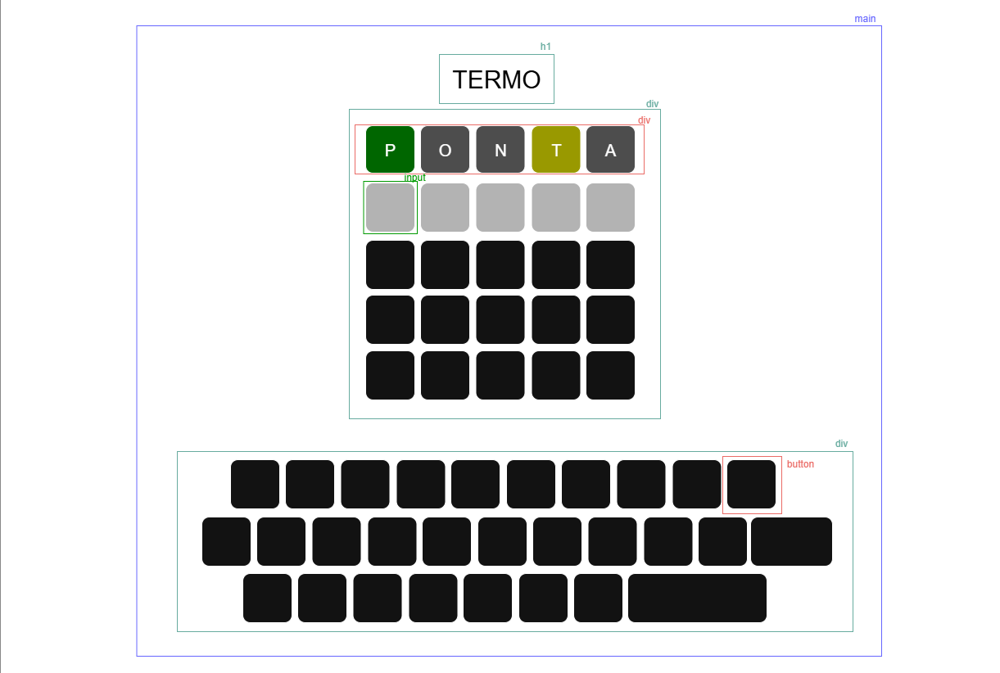

# 🦉 Owlficina Web: Front-End Essentials 💻

Este workshop foi desenvolvido para fornecer aos participantes uma compreensão sólida dos fundamentos do desenvolvimento front-end. Ao final do workshop, os participantes terão um portfólio funcional criado com HTML, CSS e JavaScript.

## O que é o Termo?
Baseado no jogo de navegador [Wordle](https://www.nytimes.com/games/wordle/index.html") criando pelo engenheiro de software Josh Wardle, o 
[Term.ooo](Https://term.ooo) foi um projeto criativo desenvolvido durante as férias do trabalho pelo brasileiro Fernando Serboncini qie explodiu pelo mundo dos falantes de português.

Descubra a palavra em 6 tentativas. A cada tentativa, as letras vão indicando o quão próximo você está!

---

## Estrutura básica do projeto:

Mapa conceitual de *estruturas* no [HTML](./index.html).

**Lista de arquivos:**
- [./assets](./assets/) : *Fontes complementares ao projeto - imagens, pdfs, arquivos, etc...*
- [./index.html](index.html) : *Arquivo HTML principal.*  
- [./index.css](index.css) : *Arquivo de estilização CSS principal.*  
